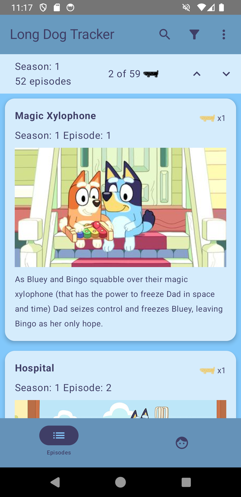

<!--
  Title: Long Dog Tracker
  Description: An app for keeping track of the Long Dogs you have found while watching Bluey
  Author: w1ll1am23
  -->

# Long Dog Tracker

### Long Dog Tracker is an app for keeping track of the Long Dogs you have fround while watching Bluey. 

## Key Features 
- Check off Long Dogs you've found
- Check to see if there is a known Long Dog in an episode 
- Add new Long Dogs
- Track how many you have found/need to find

  

## Getting Started
- Clone the repo
- Get a https://thetvdb.com/ API key see documentation here https://github.com/thetvdb/v4-api?tab=readme-ov-file
- Add that key to the projects gradle.properties files `THE_TV_DB_API_KEY=YOUR_API_KEY_HERE`
- Build and install
